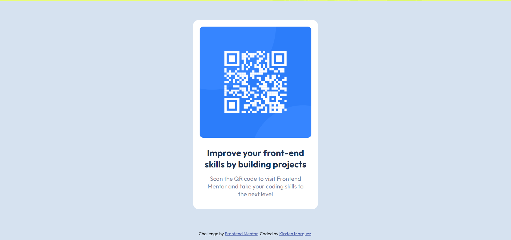

# Frontend Mentor - QR code component solution

This is a solution to the [QR code component challenge on Frontend Mentor](https://www.frontendmentor.io/challenges/qr-code-component-iux_sIO_H). Frontend Mentor challenges help you improve your coding skills by building realistic projects. 

## Table of contents

- [Overview](#overview)
  - [Screenshots](#screenshots)
  - [Links](#links)
- [My process](#my-process)
  - [Built with](#built-with)
  - [Useful resources](#useful-resources)
- [Author](#author)

**Note: Delete this note and update the table of contents based on what sections you keep.**

## Overview

### Screenshots

**Desktop**

**Mobile**

### Links

- Solution URL: [Add solution URL here](https://your-solution-url.com)
- Live Site URL: [Add live site URL here](https://your-live-site-url.com)

## My process

### Built with

- HTML
- CSS

### Useful resources

- [CSS Layout - Horizontal & Vertical Align](https://www.w3schools.com/css/css_align.asp) - This is a useful list of how to vertically and horizontally align elements. I previously used `position` and `transform` but then realized that using flexbox seemed like a cleaner solution.
- [CSS Width 100% and Position Absolute or Fixed](https://fritzthecat-blog.blogspot.com/2016/05/css-width-100-and-position-absolute-or.html) - This helped me figure out why having `width: 100%` on an element with `position: fixed` overflows out of the screen.

## Author

- Github - [Kirzten Marquez](https://github.com/kcnmarquez)
- Frontend Mentor - [@kcnmarquez](https://www.frontendmentor.io/profile/kcnmarquez)
